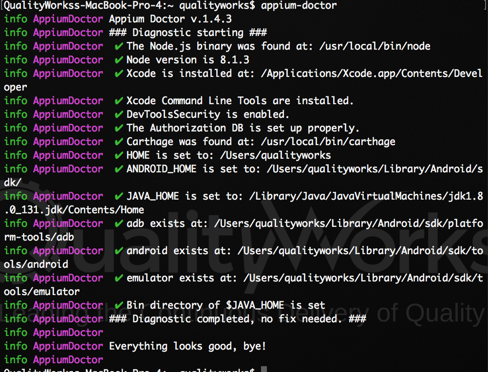

# Using Appium to Automate UI Testing of Android and iOS Apps with Java

## Overview

### What is Appium? 

Appium is an open source test automation framework for use with native, hybrid and mobile web apps. 
It drives iOS, Android, and Windows apps using the WebDriver protocol. Appium is built on the idea that testing native apps shouldn't require including an SDK or recompiling your app. And that you should be able to use your preferred test practices, frameworks, and tools. Appium also has made design and tool decisions to encourage a vibrant contributing community.

### Why Appium? 

As a test developer it is quite hard to create a good automated test suite that works on the iOS and Android platforms. Both Android and iOS have a couple of different test frameworks that work well but have nothing to do with each other. So you then have to create and maintain two separate test suites, one for Android and one for iOS. They are also written in different languages and with different development tools (IDEs) so even if the applications work the same it is hard to share any code between the tests for the different platforms.
But this is where Appium comes in. From Appium's own website:

Appium is “cross-platform”: it allows you to write tests against multiple platforms (iOS, Android), using the same API. This enables code reuse between iOS and Android testsuites.

## What's in this repository? 

This repository contains a minimalistic Appium Test Suite written in Java that runs a few simple tests on [this Android app](https://github.com/QualityWorksCG/Quality-Works-Sample-Android-app) and [this iOS app](https://github.com/QualityWorksCG/Quality-Works-Sample-iOS-App). To run the tests successfully you'll need have the .apk and the .app file of both apps so I'd recommend having those in place before getting started here if you want to see the tests run on those apps, otherwise this can be used as a starting point for your own Test Suite. 

## System Requirements

**iOS**

- Mac OSX
- XCode w/ Command Line Tools

**Android**

- Mac OSX or Windows or Linux
- Android SDK ≥ 16

## Setting up

Basically you need to have appium installed along with appium-doctor. I won't go into a walkthrough of setting these up as there are plenty resources out there to guide you in setting up Appium to test apps on both platforms. See below for a some helpful links to help you get appium and appium-doctor installed. 

- http://appium.io/
- http://appium.io/slate/en/tutorial/android.html
- http://appium.io/slate/en/tutorial/ios.html
- https://github.com/appium/appium-doctor
- http://appium.io/slate/en/master/?java#

Those links should be enough to give you all the information you need about appium, appium-doctor and getting set up. Once you have everything set up remember to use appium doctor to confirm. See below how the results of your appium doctor check should look before moving on. 



At this point everything for Appium should be installed and in that process you should've installed Apache Maven. If not take a second to install Maven.

Here's a helpful link for doing that:

- https://maven.apache.org/install.html

## Running the tests

To run your tests simply you need to  execute the following command from inside the project directory. 

```
mvn test
```

## Running the sample tests

To run the sample tests you first need to set the following enviroment variables "ios_app_path" and "android_app_path" on your system. These need to be defined globally to be the path to the iOS .app file and Android .apk file respectively. For help setting environment variables on your system check out the following links. 

- https://www.howtogeek.com/51807/how-to-create-and-use-global-system-environment-variables/ (Even though it's an outdated version of Windows in the Screenshots, the process is the same)
- https://www.cyberciti.biz/faq/set-environment-variable-unix/ (Unix and Linux Environments)

and the execute the following command from inside the project directory.


```
mvn test
```
